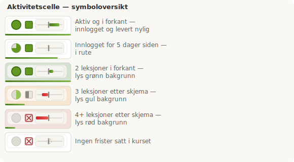

# Canvas Aktivitetskolonne

Chrome-utvidelse som legger til en diskret aktivitetskolonne i Canvas vurderingsoversikt. Læreren får et øyeblikksbilde av elevenes innlogging, innleveringsstatus, fremdrift og leseatferd — uten å forlate oversikten.

**Versjon: 15.05.2026**

---

## Første gang — det tar litt tid

Første gang du åpner en klasse henter utvidelsen data fra Canvas API i to omganger:

1. **Innlogging vises straks** — ringer dukker opp etter noen sekunder.
2. **Innleveringsdata og fremdrift** — en klasse med 30 elever og 15 leksjoner kan ha 1 000–2 000 innleveringer. Dette tar typisk 10–30 sekunder.
3. **Visningsdata** — lærestoff-prosenten lastes stille i bakgrunnen etter at tabellen er klar og fylles inn rad for rad.

Når alt er lastet caches dataene lokalt i 1 time. Neste gang du åpner samme klasse vises alt umiddelbart.

---

## Installasjon

1. Last ned og pakk ut mappen
2. Åpne Chrome og gå til `chrome://extensions`
3. Slå på **Utviklermodus** (øverst til høyre)
4. Klikk **Last inn upakket** og velg mappen
5. Gå til vurderingsoversikten i et Canvas-kurs — kolonnen vises automatisk

> Versjonsnummeret er alltid datoen for siste oppdatering (DD.MM.ÅÅÅÅ). Sjekk popup-footeren for å bekrefte at kollegiet har lastet ned nyeste versjon.

---

## Slik leser du kolonnen

Kolonnen svever på høyre kant av navnekolonnen.



### Symbol 1 — Ring (innlogging)

Sirkelen viser hvor nylig eleven var innlogget via fyllingsgrad og kanttykkelse.

| Symbol | Betyr |
|--------|-------|
| Fylt ring, tykk kant | Innlogget siste 1–3 dager |
| ¾ fylt, medium kant | Innlogget for 4–7 dager siden |
| ½ fylt, tynn kant | Innlogget for 8–15 dager siden |
| Tom, veldig tynn kant | Ikke sett på over 15 dager |

### Symbol 2 — Firkant (innlevering)

Firkanten viser status for siste innlevering.

| Symbol | Betyr |
|--------|-------|
| Fylt grønn firkant | Levert innen 7 dager |
| Halvt fylt grå firkant | Levert for 8–14 dager siden |
| Tom firkant, rød kant | Ikke levert på lenge, eller aldri |

### Symbol 3 — Fremdriftsindikator (tidslinje)

Den loddrette streken er nullpunktet — her skal eleven være akkurat nå.

| Bar | Betyr |
|-----|-------|
| Grønn bar høyre | Foran skjema |
| Ingen bar | Akkurat i rute |
| Rød bar venstre | Etter skjema |
| Full rød bar venstre | Har frister, ikke levert |
| Stiplet sirkel | Ingen frister satt i kurset |

### Fargemerking av rader

Når fargemerking er slått på får Canvas-radene en dempet trafikklys-farge:

| Farge | Betyr |
|-------|-------|
| Svakt grønn | 2 leksjoner etter skjema |
| Svakt gul | 3 leksjoner etter skjema |
| Svakt rød | 4+ leksjoner etter skjema |

1 leksjon etter regnes som innafor og gir ingen fargemerking.

### Visningsbar (bunn av cellen)

En diskret 3 px grønn stripe i nedkanten av cellen viser snittlig visningsprosent for lærestoff (Canvas-sider med fullføringskrav) i leksjonene eleven har levert oppgaver i.

- **Full grønn bar** → eleven har lest gjennom lærestoffet grundig
- **Kort grønn bar** → eleven har levert, men lest lite
- **Grå pulserende bar** → data lastes i bakgrunnen
- **Ingen bar** → ingen data tilgjengelig ennå

> **Viktig:** En elev kan ha grønn ring, grønn firkant og fremdrift i rute — men likevel ha en svært lav visningsbar. Dette avslører elever som leverer uten å lese lærestoffet. Denne profilen er usynlig i alle andre indikatorer.

---

## Hover-tooltip

Hold musen over en celle for detaljert informasjon og batteridiagrammet.


### Tekstlinjer i tooltip

| Linje | Forklaring |
|-------|------------|
| Innlogget: X dager siden | Siste aktivitet i Canvas |
| Innlevert: X dager siden | Siste registrerte innlevering |
| X av 15 leksjoner Fullført · Terskel: Y% | Godkjente leksjoner — se forklaring under |
| N innleveringer venter vurdering | Levert men ikke karaktersatt ennå |
| I forkant / På etterskudd | Avvik fra skoleruta |
| Snitt visning: X % | Gjennomsnittlig andel fullført lærestoff |
| ○ N innleveringer med status Mangler | Antall innleveringer Canvas har flagget som manglende |

### Batteridiagrammet — lærestoff sett per leksjon

Diagrammet viser én loddrett søyle per leksjon. En midtlinje skiller positiv og negativ sone.

| Element | Betyr |
|---------|-------|
| Grønn søyle oppover | Andel av Canvas-sider med fullføringskrav eleven har fullført. Full høyde = 100 % |
| Rød søyle nedover | Fristen er passert — eleven har ikke fullført noen lærerstoffsider i modulen |
| Stiplet grå søyle | Fristen er ikke passert ennå — leksjonen er fremtidig |
| Hvite sirkler (prikker) | Antall innleveringer med passert frist som ikke er levert |

**Prikkene** viser innleveringer, quizer og diskusjoner med datofrist som mangler. De forsvinner når eleven leverer og kommer tilbake hvis lærer setter status «Mangler».

**Dette er det mest pålitelige signalet på om eleven faktisk har jobbet med lærestoffet** — det avslører elever som leverer inn uten å ha gått innom sidene med lærestoff.

### De fire informasjonslagene i kombinasjon

De fire elementene utfyller hverandre og gir et komplett bilde:

| Element | Viser |
|---------|-------|
| **X av 15 Fullført** | Lærergodkjent fremdrift |
| **Venter vurdering** | Gapet mellom levert og godkjent |
| **Grønne/røde barer** | Om eleven har lest lærestoffet |
| **Prikker** | Konkrete manglende innleveringer |

En erfaren lærer kan kombinere disse og lese hele elevens situasjon på sekunder uten å klikke seg inn i Canvas.

---

## «Min fremdrift»-modal — venstre kolonne

Venstre kolonne viser en motivasjonstekst tilpasset elevens situasjon. To lag med tekst:

### Konteksttekst (under stat-boksene)

| Tekst | Trigger |
|-------|---------|
| *Grafikken viser om lærestoff og oppgaver er glemt eller hoppet over.* | På etterskudd, eller ingen godkjente leksjoner ennå |
| *Du er i forkant — bra jobbet!* | Minst én leksjon foran skjema |
| *Du følger planen* | På skjema, minst én leksjon godkjent |

### Emoji-sirkel med tekst

| Emoji | Tekst | Trigger |
|-------|-------|---------|
| 🏆 | Strålende! | Alle leksjoner i kurset godkjent |
| ⭐ | Du gjør det bra! | I forkant av skjema |
| 👍 | Fortsett sånn! | På skjema, minst én leksjon godkjent |
| 🌱 | Ikke gi opp! | På etterskudd |
| 🤝 | Vi heier på deg! | Ingen godkjente leksjoner ennå, ikke på etterskudd |

---

## Kopiering og nedlasting

Når du holder musen over en celle vises to ikoner:

**Kopieringsikon (øverst)** — kopierer en ferdig skrevet purremelding til utklippstavlen med elevens navn, innleveringslenker og frister.

Meldingen er adressert til eleven og foresatte, beskriver hvilke innleveringer som har status «Mangler» i Canvas og ber om svar. Hvilke oppgavetyper som tas med styres av innstillingen **Kopieringslenker** i popup-panelet (Alle / NQ / Unntatt NQ).

**Nedlastingsikon (nederst)** — laster ned et PNG-elevkort med navn, status og batteridiagram.

---

## New Quizzes (NQ)

New Quizzes er Canvas sin nyere quiz-motor og håndteres spesielt av utvidelsen.

**Identifisering:** NQ-oppgaver gjenkjennes via tilknyttet verktøy-URL (`quiz-lti`). Klassiske quizer brukes ikke på Globalskolen.

**Godkjenningslogikk:** NQ behandles likt andre innleveringer. Datofrist og «Mangler»-status styrer om en NQ vises som manglende, akkurat som for vanlige innleveringer.

**Kopieringslenker:** Du kan velge å inkludere kun NQ, kun andre innleveringer, eller alle i purremeldingen.

---

## Slik tolker du tallene — viktig å vite

### «X av 15 leksjoner Fullført» — hva teller?

Tallet 15 er fast og representerer det totale antallet leksjoner i kurset. Det er knyttet til statsstøttekravet om at elever skal ha fullført minst 12 av 15 leksjoner.

En leksjon teller som **Fullført** når tilstrekkelig andel av innleveringene med passert frist er **karaktersatt som godkjent** av lærer — ikke bare levert. Unntak: leksjoner der eleven har levert i forkant (fremtidig frist) teller som fullført siden karaktersetting ikke er forventet ennå.

Gapet mellom det eleven har levert og det som er karaktersatt vises i linjen **«N innleveringer venter vurdering»**. En lærer kan altså kombinere «X av 15» og «venter vurdering» for å forstå om lav score skyldes manglende levering eller manglende retting.

### Terskelprosent

Terskelen styrer hvor mange innleveringer i en leksjon som må være karaktersatt som Fullført for at leksjonen teller. Standard er 50 % — justerbar i popup-panelet.

### Hva teller som «godkjent»?

| Valg | Hva som teller |
|------|----------------|
| Alle (standard) | NQ teller ved innlevering, andre innleveringer ved lærergradering |
| NQ | Kun New Quizzes, og kun ved innlevering |
| Unntatt NQ | Kun vanlige innleveringer og diskusjoner, kun ved lærergradering |

---

## Hvordan fremdriften beregnes

Oppgavene grupperes per leksjon basert på hvilken **modul** de tilhører i Canvas. Én modul = én leksjon.

**Per leksjon:**

Kun oppgaver med passert frist teller i beregningen — fremtidige frister ignoreres. Dette gjør beregningen dynamisk: en elev som er i forkant telles som i forkant, ikke som bak.

- **Godkjent** (≥ terskel karaktersatt av passerte): teller positivt
- **Levert men ikke karaktersatt**: vises som «venter vurdering», teller ikke som Fullført
- **Ikke godkjent** (< terskel): trekker fra netto fremdrift
- **Leksjon med fremtidig frist, levert**: bidrar positivt som «i forkant» og teller som Fullført

**Trafikklys-farge:**
```
leksjoner etter skjema = leksjoner med passert frist − godkjente av disse
```

**Batteridiagrammets barer** beregnes separat fra fremdriften. De henter Canvas sin egen fullføringsstatus for sider med fullføringskrav (`must_view`, `must_mark_done`, `must_submit` osv.) via modul-API-et — uavhengig av innleveringsdata.

---

## Innstillinger

Klikk utvidelsesikonet i Chrome for å åpne innstillingspanelet.

| Innstilling | Standard | Forklaring |
|-------------|----------|------------|
| Fylt ring | ≤ 3 dager | Grense for nylig innlogging |
| ¾ fylt ring | ≤ 7 dager | Grense for relativt nylig innlogging |
| Levert nylig | ≤ 7 dager | Grense for grønn firkant |
| En stund siden | ≤ 14 dager | Grense for grå firkant |
| Leksjon godkjent når | ≥ 50% | Terskel for leksjonsberegning |
| Godkjenningsgrunnlag | Alle | Hva som teller som godkjent (Alle / NQ / Unntatt NQ) |
| Fargemerking | Av | Trafikklys-farge på Canvas-rader |
| Kopieringslenker | Alle | Hvilke oppgavetyper som tas med i purremelding |

---

## Personvern og GDPR

Elevdata forlater aldri Canvas sine egne servere.

- Utvidelsen henter data fra Canvas sitt eget API med din eksisterende innloggingssesjon
- Elevdata lagres kortvarig i `chrome.storage.local` kun for caching (maks 1 time)
- Ingen elevdata sendes til eksterne servere eller tredjepart
- Kun dine egne innstillinger synkroniseres mellom maskiner — ingen personopplysninger

---

## Canvas-skript for elever

Det følger med én aktiv JavaScript-fil som lastes opp i Canvas sitt globale JavaScript-felt (Admin → Tema → JS):

**`canvas-global_med_kulelenker_MED_PURREVINDU.js`**

Denne filen inneholder:

- **Kuleramme** — horisontal navigasjonsmeny øverst på leksjonssider. Viser alle sider og innleveringer i leksjonen som kuler på en tråd. Farger og badge-ikoner viser fremdrift i sanntid: grønn ✓ = fullført, oransje = levert/venter vurdering, rød = mangler, grå = ikke gjort ennå.
- **Min fremdrift** — flytende knapp og modal med batteridiagram og statistikk for eleven
- **Purrevindu** — grønt banner til elever med uleverte oppgaver med passert frist
- **Tooltip på gjøremålslenker** — klikkvennlige lenker i Canvas sin gjøreliste
- **Premieikon og diplom** — vises ved fullføring av leksjon og kurs

> Andre `canvas-*.js`-filer i mappen er eldre varianter som ikke lenger er i bruk.

---

## Teknisk

- Manifest V3 — versjon 15.05.2026
- Aktiveres kun på `*.instructure.com/courses/*/gradebook*`
- Canvas REST API-endepunkter som brukes:
  - `enrollments` med `last_activity_at`
  - `students/submissions` med `missing`-flagg, `workflow_state`, `grader_id`, `submitted_at`, `graded_at`, `read_state`, `submission_comments`
  - `assignments` med `due_at`, `grading_type`, `submission_types`, `external_tool_tag_attributes`, `html_url`, `discussion_topic.id`
  - `modules` med `items` og `student_id` — for leksjonsgruppering og fullføringsstatus
  - `users/self` — for elevens profilbilde (`avatar_url`)
- Data caches i `chrome.storage.local` med 1-times utløp per kurs

---

## Kjente begrensninger og åpne punkter

- Canvas sin gradebook bruker virtuell scrolling (SlickGrid). DOM-strukturen kan variere mellom Canvas-versjoner
- Utvidelsen er testet på `*.instructure.com`. Andre domener krever endring av `host_permissions` i `manifest.json`
- Batteridiagrammet viser kun moduler som har Canvas-sider med fullføringskrav. Moduler som kun inneholder oppgaver/quizer uten sider kan mangle søyle selv om de har prikker
- Prikkene bruker `completion_requirement.completed` fra Canvas modulAPI som primærsignal. Lærer-satt «Mangler» (`sub.missing = true`) overstyrer og flytter prikken under streken selv om Canvas viser grønn hake i modulen. «Ikke fullført» som karakterverdi uten manuelt «Mangler»-flagg fanges ikke opp — dette er en kjent begrensning som krever rutine hos lærerne
- **Diskusjonsoppgaver** (`must_contribute`) vises korrekt i «Min fremdrift»-modalen. Canvas bruker `discussion_topic_id` som `content_id` i moduler, mens submissions bruker `assignment_id` — utvidelsen oversetter disse automatisk. Siden `submitted_at` alltid er `null` for diskusjoner, brukes `graded_at` som dato når lærer har satt karakter. Diskusjoner uten karakter bruker kommentardato som fallback
- `must_mark_done` (Merk som ferdig) er ikke i bruk på skolen og fanges ikke opp i prikkelogikken. Items med dette kravet vil ikke vises i batteridiagrammet
- Aktivitetskolonnen (lærervisning) henter moduldata uten `student_id` og kan ikke bruke `completion_requirement.completed` per elev. Prikkelogikken der er fortsatt submissions-basert og fanger ikke opp `must_mark_done` eller items uten datofrist
- **«Legg til elevoppgave» + «Vis»-krav** på en Canvas-side er trygt å bruke. Siden forblir en `Page` i API-et og teller normalt i de grønne barene — ikke som innlevering. Kombinasjonen gjør at siden vises i elevens gjøreliste og kalender uten å påvirke X av 15, prikker eller venter-vurdering. Testet og bekreftet 10.04.2026.

---

## Lisens

MIT
